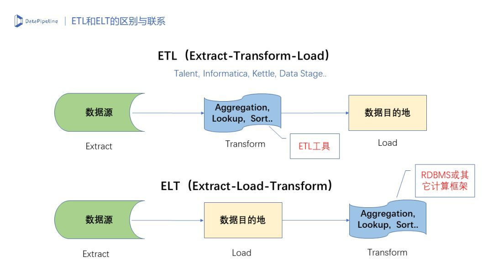

# 介绍
ETL，Extraction-Transformation-Loading的缩写，中文名为数据抽取、转换和加载。 ELT，Extraction-Loading-Transformation的缩写，中文名为数据抽取、加载和转换。
ETL负责将分布的、异构数据源中的数据如关系数据、平面数据文件等抽取到临时中间层后进行清洗、转换、集成，最后加载到数据仓库或数据集市中，成为联机分析处理、数据挖掘的基础。ETL是BI项目最重要的一个环节，通常情况下ETL会花掉整个项目的1/3的时间，ETL设计的好坏直接关接到BI项目的成败。ETL也是一个长期的过程，只有不断的发现问题并解决问题，才能使ETL运行效率更高，为项目后期开发提供准确的数据。

# 解释
E（Eextract）：抽取
数据抽取可以从数据库、文本文件、Web网页，WebService等地方抽取，抽取的过程会把不规范的数据转化为规范的数据。

T（Transform）：转换
用于转换的数据已经是规范化的数据，转换就是对这些数据进行处理：使符合规则的数据入库，不符合规则的数据进行人工核验或者系统自动修复等，把不符合规则的数据变成符合规则的数据后入库。

L（Load）：加载
ETL是大数据处理数据的一种操作流程，即 抽取数据->然后数据转换->最后加载数据。

# 区别

  
根据转换转换发生的顺序和位置，数据集成可以分为 ETL 和 ELT 两种模式。ETL 在数据源抽取后首先进行转换，然后将转换的结果写入目的地。ELT 则是在抽取后将结果先写入目的地，然后由下游应用利用数据库的聚合分析能力或者外部计算框架，例如 Spark 来完成转换的步骤。

# 为什么 ELT 更适合 AI 应用场景

- AI 应用对数据转换的高度灵活性需求决定的  
绝大多数 AI 应用使用的算法模型都包括一个特征提取和变换的过程。根据算法的不同，这个特征提取可能是特征矩阵的简单的归一化或平滑处理，也可以是用 Aggregation 函数或 One-Hot 编码进行维度特征的扩充，甚至特征提取本身也需要用到其它模型的输出结果。这使得 AI 模型很难直接利用 ETL 工具内建的转换功能，来完成特征提取步骤。此外，企业现在很少会从零构建 AI 应用。当应用包括 Spark/Flink MLlib 在内的机器学习框架时，内建的模型库本身往往包含了特征提取和变换的逻辑，这使得在数据提取阶段就做复杂变换的必要性进一步降低。

- 企业经常会基于同样的数据构建不同应用  
以我之前所在的一家在线教育公司为例，我们构建了两个 AI 的应用：其中一个是针对各类课程的推荐应用，主要用于增加用户的购买转化率。另外一个是自适应学习系统，用于评估用户的知识掌握程度和题目的难度和区分度，从而为用户动态地规划学习路径。两个应用都需要用户属性、做题记录、点击行为以及学习资料文本，但采用的具体模型的特征提取和处理方式完全不同。如果用 ETL 模式，我们需要从源端抽取两遍数据。而采用 ELT 模式，所有数据存储在 HBase 中，不同的应用根据模型需要过滤提取出所需的数据子集，在 Spark 集群完成相应的特征提取和模型计算，降低了对源端的依赖和访问频次。

- 维护和扩展  
主流的机器学习框架，例如 Spark MLlib 和 Flink MLlib，对于分布式、并行化和容错都有良好的支持，并且易于进行节点扩容。 采用 ELT模式，我们可以避免构建一个专有数据转换集群（可能还伴随着昂贵的 ETL 产品 License费用），而是用一个通用的、易于创建和维护的分布式计算集群来完成所有的工作，有利于降低总体拥有成本，同时提升系统的可维护性和扩展性。

# ETL 和 ELT 面临的主要问题
采用 ELT 模式，意味着可以较少的关注数据集成过程中的复杂转换，而将重点放在让数据尽快地传输上。然而，一些共性的问题依然需要得到解决:

- 数据源的异构性：  
传统 ETL 方案中，企业要通过 ETL 工具或者编写脚本的方式来完成数据源到目的地同步工作。当数据源异构的时候，需要特别考虑 Schema（可以简单理解为数据字段类型）兼容性带来的影响。无论是 ETL 还是 ELT，都需要解决这一问题。

- 数据源的动态性：   
动态性有两方面含义。一是如何获取数据源的增量；二是如何应对数据源端的 Schema 变化，例如增加列和删除列。

- 任务的可伸缩性：   
当面对少量几个数据源，数据增量不过每日几百 MB 的时候，ELT 平台的可伸缩性不是什么大问题。当 ELT 面对的是成百上千个数据源，或者数据源数据增速很快时，ELT 平台的任务水平切分和多任务并行处理就成为一个必备的要求。平台不仅要支持单节点的多任务并行，还需要支持节点的水平扩展。此外，ELT的上游通常会遇到一些吞吐能力较差的数据源，需要能够对读取进行限速，避免对现有业务产生影响。

- 任务的容错性：  
ELT 平台某些节点出现故障的时候，失败的作业必须能够迁移到健康的节点上继续工作。同时，作业的恢复需要实现断点重传，至少不能出现丢失数据，最好能够做到不产生重复的数据。

# 引用:
[什么是ETL？一句白话告诉你！](https://zhuanlan.zhihu.com/p/108187356)  
[DataPipeline CTO陈肃：从ETL到ELT，AI时代数据集成的问题与解决方案](https://zhuanlan.zhihu.com/p/40959610)